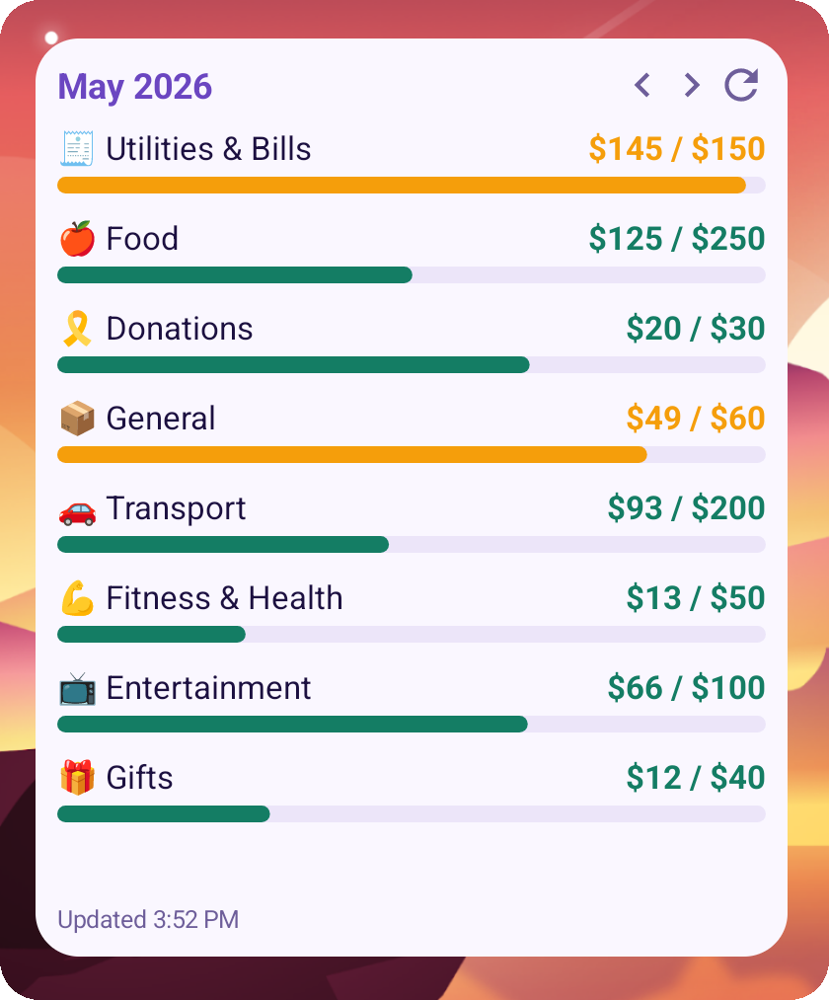
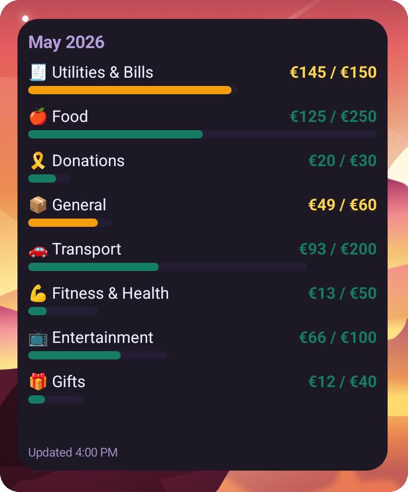
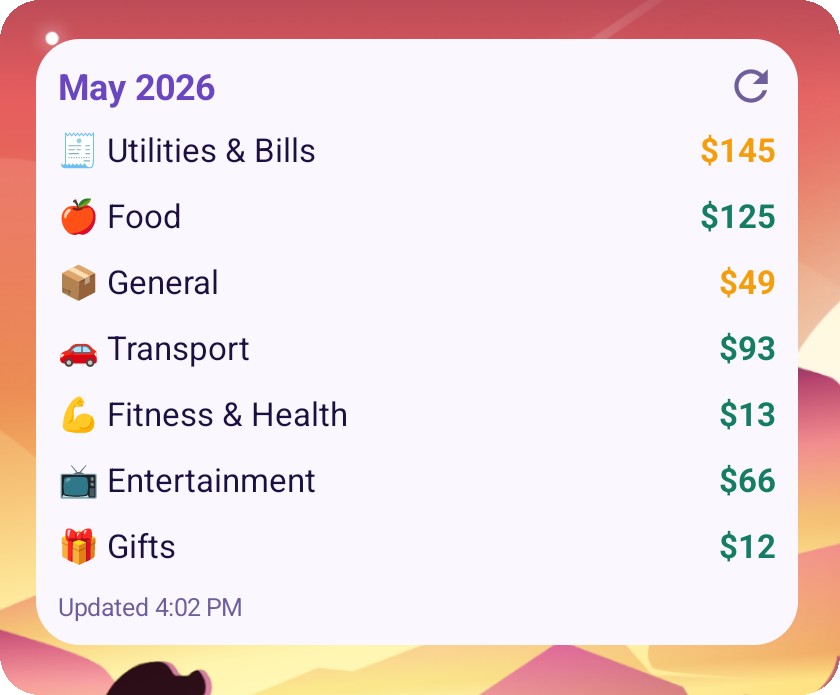
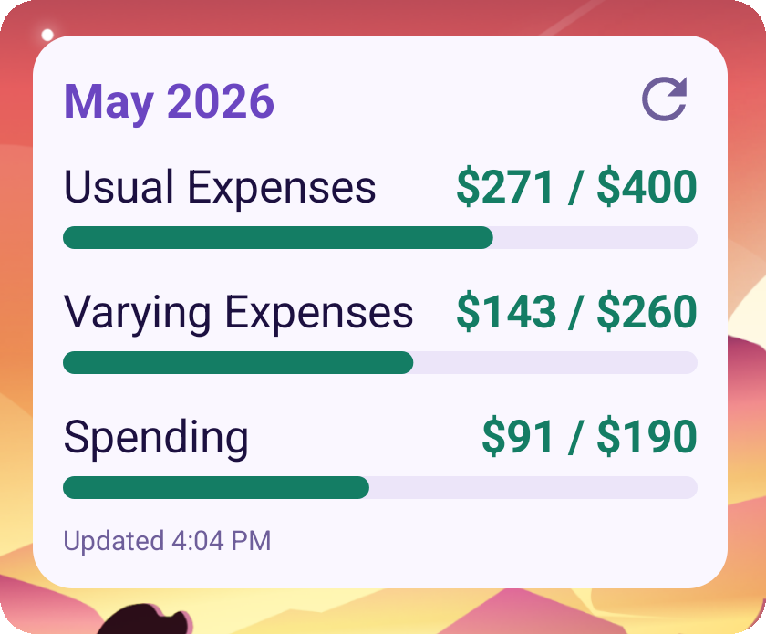
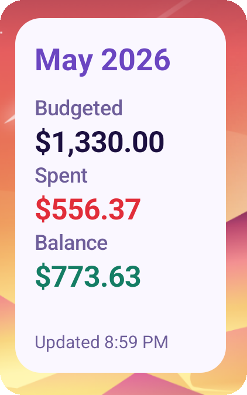
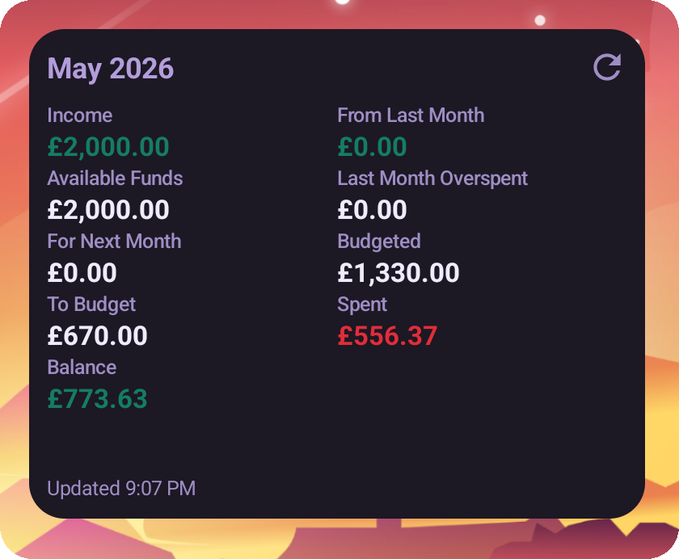
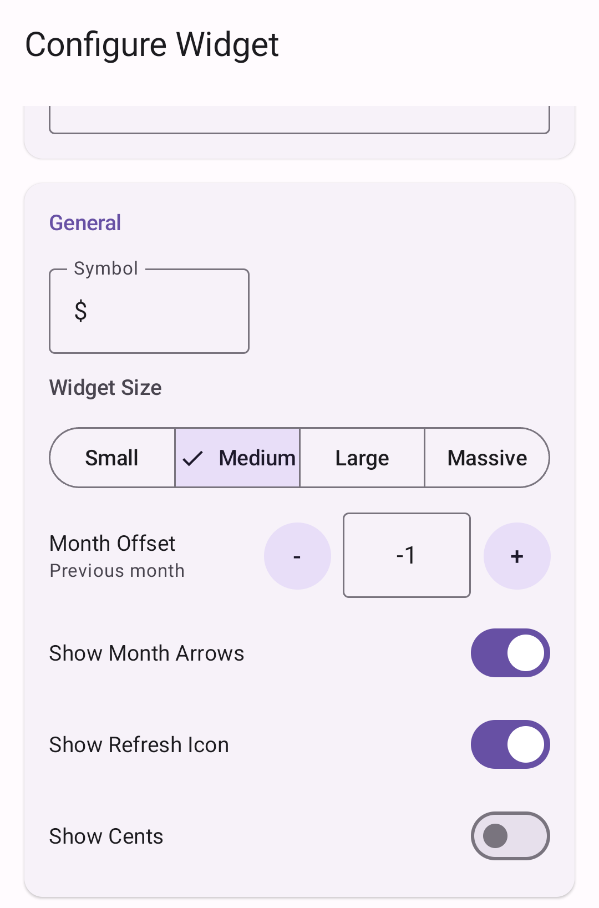
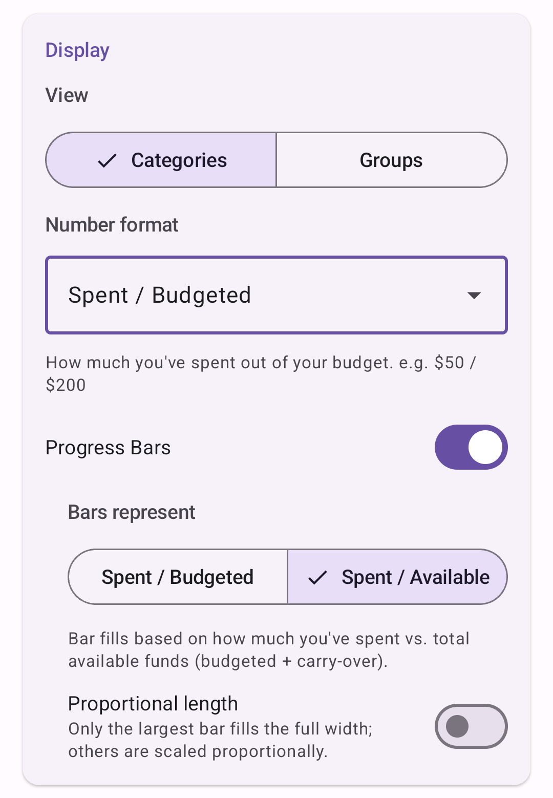
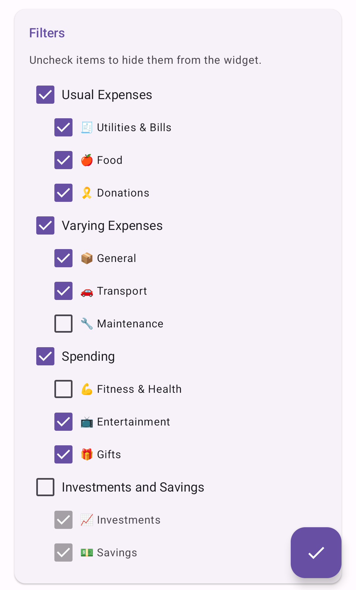

# Actual Budget Android Widgets

[](https://github.com/histefanhere/actual-budget-android-widgets/releases)
[](https://github.com/histefanhere/actual-budget-android-widgets/actions/workflows/release.yml)
[](LICENSE)
[](https://developer.android.com/about/versions/oreo)
[](https://kotlinlang.org/)

A small companion app for keeping your finances from [Actual Budget](https://actualbudget.org/) visible at a glance. Born out of an obsession of staying up-to-date with my budgets!

It connects to your Actual Budget server through [actual-http-api](https://github.com/jhonderson/actual-http-api) which is a requirement server-side.

|  |  |  |
|--------------------------------------------------------|--------------------------------------------------------|----------------------------------------------------------------|
|     |     |             |

## Features

- Monthly Summary widget with configurable budget stats
- Category Breakdown widget for category or group spending
- Configurable currency symbol, amount precision, and widget size
- Optional category progress bars
- Manual refresh button and automatic background refresh
- Support for local HTTP Actual Budget setups

### Configuration

| General Options                                 | Widget Display Options (Widget type specific)   | Filter Options                                         |
|-------------------------------------------------|-------------------------------------------------|--------------------------------------------------------|
|  |  |          |

## Requirements

- Android 8.0 or newer
- A running [Actual Budget](https://actualbudget.org/) instance
- A running [actual-http-api](https://github.com/jhonderson/actual-http-api) instance

## Installation

Download the latest APK from [Releases](../../releases), then install it on your
Android device.

You can also install and update the app with
[Obtainium](https://github.com/ImranR98/Obtainium). Add this repository URL and
use the GitHub source:

```text
https://github.com/histefanhere/ActualBudgetAndroidWidgets
```

## Setup

1. Configure `actual-http-api` for your Actual Budget server.
2. (Recommended) Find your actual-http-api API key and copy it to save it to your clipboard for easier setup.
3. Add either the Monthly Summary or Category Breakdown widget to your home
   screen.
4. Enter your server URL, API key, and budget.
5. Save the widget configuration.

Example server URLs:

```text
http://192.168.1.100:5006
https://my-actual-budget-instance.example.com
```

Widgets refresh automatically about every 30 minutes while connected to a
network. You can also refresh them manually from the widget.

## Building

Prerequisites:

- Android Studio
- JDK 17 or newer

Build a debug APK:

```bash
./gradlew assembleDebug
```

Install the debug build on a connected device:

```bash
./gradlew installDebug
```

The debug APK is generated at:

```text
app/build/outputs/apk/debug/app-debug.apk
```

## Releases

See the [Releases](../../releases) page for APK downloads and release notes.

## HTTP Support

Self-hosted Actual Budget setups often run on a local network over plain HTTP.
This app allows cleartext HTTP traffic so those setups work without extra
configuration. HTTPS is also supported and always recommended.

## Acknowledgements

This project builds on work from:

- [Actual Budget](https://github.com/actualbudget/actual), the budgeting app
  this widget app is designed for
- [actual-http-api](https://github.com/jhonderson/actual-http-api), the local
  REST API bridge used to connect to Actual Budget

## Similar Projects

Other projects in the Actual Budget ecosystem:

- [Actual Budget iOS Widget](https://github.com/TaylorJns/Actual-Budget-iOS-Widget) (The inspiration for this project!)
- [Actual Accounts iOS App](https://github.com/BearTS/actual-budget-app/tree/dev)
- [Actual Budget Home Assistant Integration](https://github.com/jlvcm/ha-actualbudget)

## License

MIT. See [LICENSE](LICENSE).
