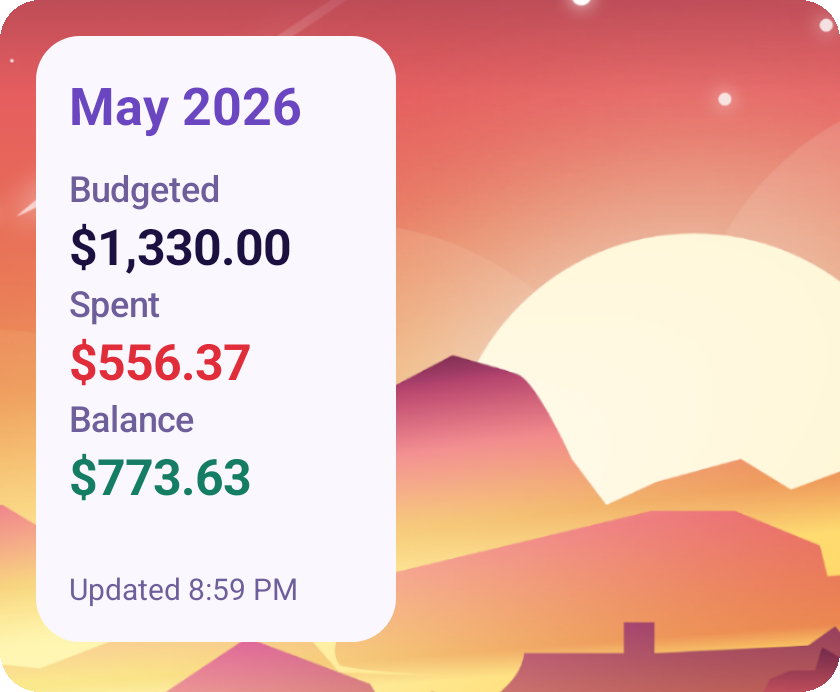

# Actual Budget Android Widgets

[](https://github.com/histefanhere/actual-budget-android-widgets/releases)
[](https://github.com/histefanhere/actual-budget-android-widgets/actions/workflows/release.yml)
[](LICENSE)
[](https://developer.android.com/about/versions/oreo)
[](https://kotlinlang.org/)

A small companion app for keeping your finances from [Actual Budget](https://actualbudget.org/) visible at a glance. Born out of an obsession of staying up-to-date with my budgets!

It connects to your Actual Budget server through [actual-http-api](https://github.com/jhonderson/actual-http-api) to showcase your budgets with two different highly-configurable widgets:

#### 1. 📉 Category Breakdown Widget

Visualize spending for the month in each category or category groups with progress bars that gradually fill as you spend

#### 2. 📅 Monthly Summary Widget

See overall statistics for each month such as Budgeted, Spent, Balance, Income, etc.

|  |  |  |
|--------------------------------------------------------|--------------------------------------------------------|----------------------------------------------------------------|
|     |   |             |

## 📥 Installation

Download the latest APK from GitHub Releases and install it manually, or you can also install and update the app automatically via [Obtainium](https://github.com/ImranR98/Obtainium):

[](https://github.com/histefanhere/ActualBudgetAndroidWidgets/releases)
[](http://apps.obtainium.imranr.dev/redirect.html?r=obtainium://add/https://github.com/histefanhere/ActualBudgetAndroidWidgets)

## ⚙️ Configuration

- 🔡 Choose exactly how your widgets appear with scaling from small to very large and adjustable font/element sizes
- 💱 Configurable currency symbol & adjust if numbers are presented with cent-precision
- 🔄 Manual refresh button and automatic background refresh
- 📆 Month offset so you can have widgets that always show last month statistics
- 👁️ Show & hide almost every UI element in the widget!
- 📊 [Category Breakdown Widget] Choose if every bar is the same length or if they scale to their budget
- 💰 [Category Breakdown Widget] Choose between showing totals out of your amount budgeted or available money in that category
- 📋 [Monthly Summary Widget] Choose between 9 different statistics to show and tailor it exactly to what you want to see

My belief is that if it exists, "it" being a feature or UI element or app behavior, you should have *the option of choosing whether you want it or not.* (possibly stemming from being force-fed features I didn't ask for in current popular apps ;-;)

So, many elements of these widgets can be configured to your liking in the configuration for each widget:

| General Options                                 | Display Options (Widget type specific)         | Filter Options                                         |
|-------------------------------------------------|------------------------------------------------|--------------------------------------------------------|
|  |  |          |

I encourage you to play around with all these options and tune the widgets to exactly your liking! 🎨

## 📋 Requirements

- Android 8.0 or newer
- A running [Actual Budget](https://actualbudget.org/) instance
- A running [actual-http-api](https://github.com/jhonderson/actual-http-api) instance

## 🚀 Setup

1. Configure `actual-http-api` for your Actual Budget server.
2. (Recommended) Find your actual-http-api API key and copy it to save it to your clipboard for easier setup.
3. Add either the Monthly Summary or Category Breakdown widget to your homescreen.
4. Enter your server URL, API key, and budget.
5. Save the widget configuration.

Example server URLs:

```text
http://192.168.1.100:5006
https://my-actual-budget-instance.example.com
```

Widgets refresh automatically about every 30 minutes while connected to a
network. You can also refresh them manually from the widget.

## 🔨 Building

Prerequisites:

- Android Studio
- JDK 17 or newer

Build a debug APK:

```bash
./gradlew assembleDebug
```

Install the debug build on a connected device:

```bash
./gradlew installDebug
```

The debug APK is generated at:

```text
app/build/outputs/apk/debug/app-debug.apk
```

## 🙏 Acknowledgements

This project builds on work from:

- [Actual Budget](https://github.com/actualbudget/actual), the budgeting app
  this widget app is designed for
- [actual-http-api](https://github.com/jhonderson/actual-http-api), the local
  REST API bridge used to connect to Actual Budget

## 🔗 Similar Projects

Other projects in the Actual Budget ecosystem:

- [Actual Budget iOS Widget](https://github.com/TaylorJns/Actual-Budget-iOS-Widget) (The inspiration for this project! 💡)
- [Actual Accounts iOS App](https://github.com/BearTS/actual-budget-app/tree/dev)
- [Actual Budget Home Assistant Integration](https://github.com/jlvcm/ha-actualbudget)

## 📄 License

MIT. See [LICENSE](LICENSE).
